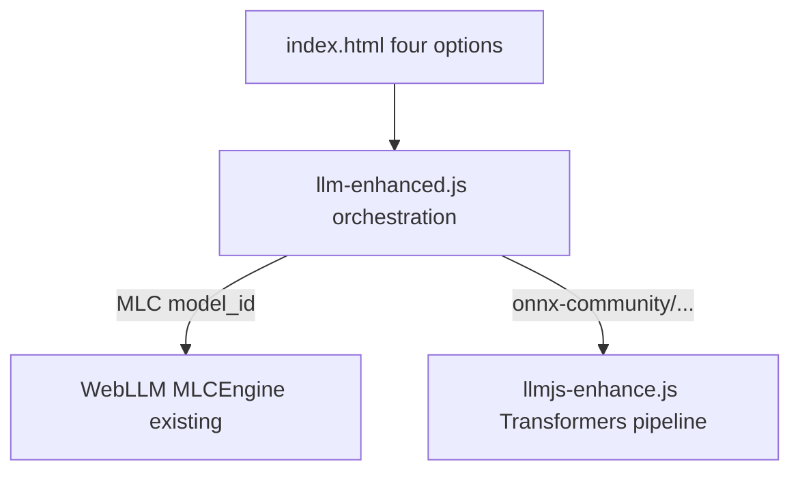

# Add Transformers.js Qwen3.5 alongside WebLLM (four-option dropdown)

## Is “ADD llmjs-enhance.js + four options” easier?

**Yes, in terms of risk and rollout:** you keep the current **WebLLM** stack in [llm-enhanced.js](llm-enhanced.js) working as-is for the two existing MLC models, and add a **second backend** for Qwen3.5 without deleting MLC support.

**Not proportionally easier in total work:** the game still needs **one** implementation of translate / stream-enhance / hints wired to the command pipeline. That means either:

- **Small edits to [llm-enhanced.js](llm-enhanced.js)** to **branch** on the selected model (WebLLM vs Transformers), calling into **`llmjs-enhance.js`** for the ONNX path, **or**
- A new thin **router** module that both backends register with (more files, clearer separation).

Duplicating `handleCmdEnhanced` in two files would be **harder to maintain** — the plan should **not** do that.

## Proposed layout

| Piece | Role |
|--------|------|
| [index.html](index.html) | `#llm-model` with **four** `<option>`s: e.g. `Qwen3-1.7B-q4f16_1-MLC`, `Qwen3-0.6B-q4f16_1-MLC`, `onnx-community/Qwen3.5-0.8B-Text-ONNX`, `onnx-community/Qwen3.5-2B-ONNX` (labels user-friendly). |
| [llm-enhanced.js](llm-enhanced.js) | Stays the **entry**: `toggleLLM`, `loadModel`, `handleCmdEnhanced`, progress UI — extended to **dispatch** load/inference to WebLLM **or** `llmjs-enhance.js` based on selection. |
| **llmjs-enhance.js** (name as you suggested) | **Only** Transformers.js: `pipeline`, load/switch/dispose, `translateInput` / `enhanceOutput` / `deliverHint` using the **same prompts** as today (copy or import shared prompt strings from a tiny shared `llm-prompts.js` if you want zero drift). |

## Why not two completely separate enhancer scripts?

If both scripts attach their own `keydown` / `toggleLLM`, they **fight**. One module must own the UI and delegate.

## Lazy loading

On first paint, **do not** import `@huggingface/transformers` until the user selects an ONNX model or enables LLM with that model — keeps initial load smaller when users only use MLC.

## WebGPU gate

Today [llm-enhanced.js](llm-enhanced.js) hides the LLM UI when `!navigator.gpu`. For Transformers.js, **WASM fallback** is valid — orchestration can show the toggle for ONNX models even without WebGPU, or keep one policy for both (product choice).

## Model notes

- **Qwen3.5-0.8B-Text-ONNX** — preferred first ONNX in-game.
- **Qwen3.5-2B-ONNX** — heavier / different arch; keep as fourth option but expect more OOM risk.

## Compared to “replace WebLLM”

| Approach | Pros | Cons |
|----------|------|------|
| **Add llmjs-enhance.js + 4 options** | Preserves MLC users; incremental ship; A/B test backends | Orchestration + two dependency trees; must avoid duplicate command logic |
| **Replace WebLLM only** | Single backend | Breaks existing MLC/offline setup until Transformers parity proven |

**Recommendation:** proceed with the **additive** design unless you explicitly want to drop WebLLM later.
